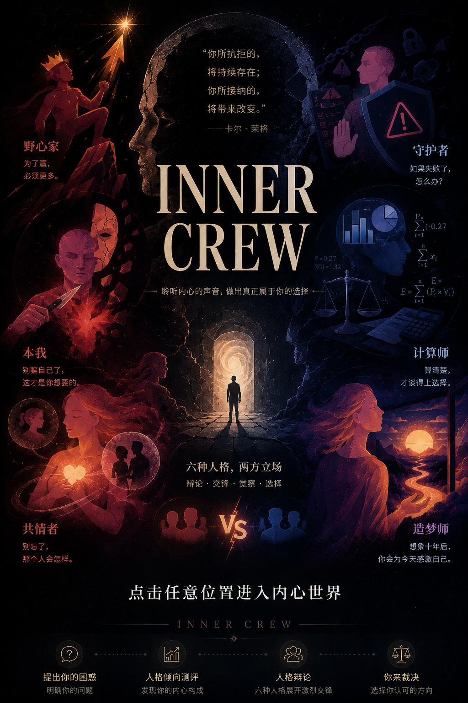

# Inner Crew

<p align="center">
  
</p>

Inner Crew 是一个面向“难以做决定”的互动式 AI 决策会议项目。

用户输入一个正在纠结的问题后，系统会先通过一组会前问询理解用户的倾向，再让六个拟人化的内心声音围绕议题进行多轮讨论。最后，用户自己做出裁断，系统生成一份可回看、可复制、可导出的决策建议书。

## 项目功能

- **随机议题与自定义议题**：用户可以自己输入问题，也可以从题库随机抽取适合讨论的 A/B 型议题。
- **会前问询**：通过若干情境问题计算用户与六种人格声音的匹配程度。
- **人格卡片**：六个人格拥有正反面卡牌、匹配星级、简介和随机台词。
- **多轮内心会议**：人格会分成不同阵营，进行队长陈词、选边发言、盲点交锋、底线补充等讨论。
- **可随时裁断**：每轮结束后用户可以选择继续听，或直接进入裁决。
- **决策建议书**：根据完整会议记录生成最终建议、可执行步骤、风险提醒和各方立场。
- **会议详细记录**：回看会前问题、选择影响、人格倾向雷达图、完整会议文字记录和最终报告。
- **历史记录**：本地保存过往提问，方便再次查看之前的详细记录。
- **导出与复制**：支持复制会议纪要 PNG，便于分享。

## 六个内心声音

| 人格 | 代表倾向 |
| --- | --- |
| 计算师 | 理性、概率、资源盘点 |
| 造梦师 | 想象、远方、可能性 |
| 守护者 | 风险、责任、安全边界 |
| 野心家 | 进取、胜负、突破 |
| 共情者 | 关系、他人感受、代价 |
| 本我 | 欲望、直觉、真实想要 |

## 技术栈

- 后端：FastAPI
- 前端：原生 HTML / CSS / JavaScript 单页应用
- 模型调用：OpenAI 兼容接口，默认支持 DeepSeek，也保留 StepFun 配置
- 流式输出：Server-Sent Events
- 依赖管理：uv
- 部署：Docker / Render 配置已包含在仓库中

## 本地运行

1. 安装依赖

```bash
uv sync
```

2. 在项目根目录创建 `.env`

DeepSeek 示例：

```env
LLM_PROVIDER=deepseek
DEEPSEEK_API_KEY=你的 DeepSeek API Key
DEEPSEEK_MODEL=deepseek-v4-flash
DEEPSEEK_THINKING=disabled
```

如果想使用 StepFun，也可以配置：

```env
LLM_PROVIDER=stepfun
STEPFUN_API_KEY=你的 StepFun API Key
STEPFUN_MODEL=step-2-16k
STEPFUN_REASONING=low
```

3. 启动服务

```bash
uv run uvicorn main:app --reload
```

4. 打开页面

```text
http://127.0.0.1:8000/
```

## 无 API 预览

项目内置了一个回放模式，适合在没有模型 API 时快速查看交互效果：

```text
http://127.0.0.1:8000/?replay
```

## 项目结构

```text
.
├── main.py              # FastAPI 入口与接口编排
├── models.py            # LLM Provider 与模型配置
├── personas.py          # 六个人格的提示词与发言逻辑
├── scoring.py           # 问询选择、人格分数与会议排序
├── constants.py         # 题库、卡片、人格常量
├── static/              # 前端页面与静态资源
├── cover/               # 封面图
├── card/                # 人格卡片图
├── music/               # 音频资源
├── docs/                # 设计文档与截图
├── Dockerfile           # Docker 部署
└── render.yaml          # Render 部署配置
```

## 安全说明

请不要把 `.env` 或任何真实 API Key 提交到 GitHub。仓库中的模型配置只应保存变量名和默认值，真实密钥应放在本地 `.env` 或部署平台的环境变量中。

## 项目定位

Inner Crew 不是替用户做决定的工具，而是把用户心里原本混在一起的声音拆开，让它们彼此辩论。最终拍板的人仍然是用户自己。
