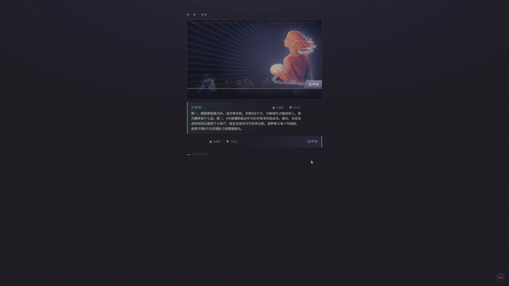
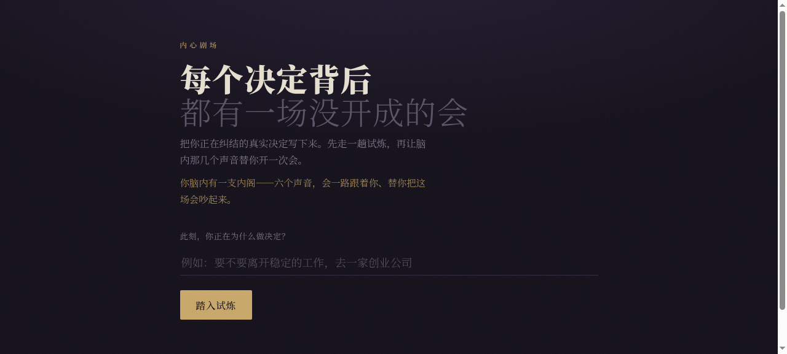
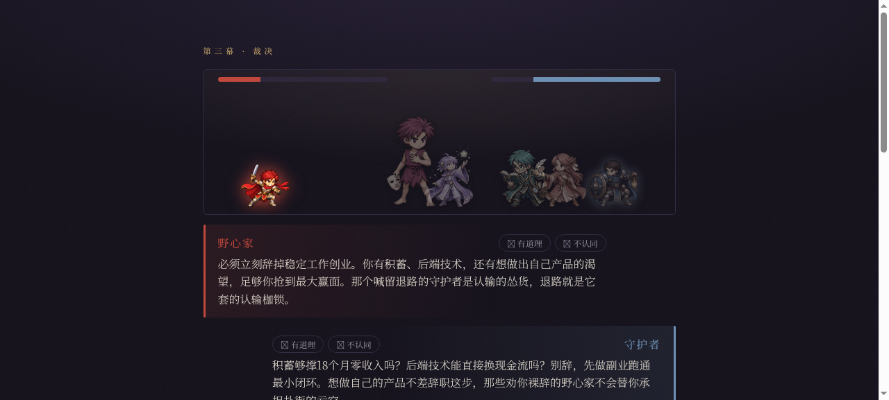

# Inner Crew · 内心剧组

> 重要决策时，帮你把脑内"没开成的那场会"真正开起来。
> An LLM-powered "inner council": six opinionated AI personas debate your real dilemma and hand you an actionable decision brief.

🎥 **完整演示**（3 分钟 · 带旁白）— 顶部 GIF 是高潮预览，下方播放器是带声音的完整版：

<p align="center">
  
</p>

https://github.com/user-attachments/assets/f9f6a0c3-7f7f-4271-8a90-c1a1d61f77bb

---

## 这是什么

你面对一个重要决策（要不要离职、该不该读研、接不接这个 offer……），脑子里其实有好几个声音在吵，但从没把它们摆到一张桌上认真开完一场会。**Inner Crew** 把这些声音具象成 6 个极端化的 AI 人格，走完一条完整的决策仪式：

**立题 → 三步地牢(测人格) → 想法卡片结算 → 会前自陈问询 → 决策会议三幕 → 决策建议书**

最后产出一份结构化、可执行的**决策建议书**——以你自己的裁决为基调，融入你认可的发言、回应你不认同的意见，并附上风险提示与落败方的保留意见。

## 六个人格 · 三条对立轴

每个人格都是一个独立的 `Agent`，prompt 极端化、固定句式、禁止中立——盲测里分不清谁是谁就重写。两两对立，保证会议永远有真正的冲突：

| 对立轴 | 正方 | 反方 |
|---|---|---|
| 进取 ↔ 守成 | **野心家** 要你扑上去 | **守护者** 要你守住底线 |
| 利他 ↔ 利己 | **共情者** 顾及他人 | **本我** 只问你真正想要什么 |
| 理性 ↔ 感性 | **计算师** 摆数据(可联网检索) | **梦想家** 谈愿景 |

<p align="center">
  
  
</p>

## 技术亮点

这个项目真正花力气的地方在**后端编排**与**驯服推理模型**：

- **薄前端 / 厚后端，零持久化。** 全部流程逻辑（在哪一幕、积分、掉卡、排序）是 Python 纯函数（`scoring.py`，可单测）；前端只"报告用户动作 + 渲染返回"。全局状态由前端持有、每次请求带给后端，后端算完返回——**服务端完全无状态**，所以能随便扩、随便重启、天然适配免费托管。
- **6 人格 = 6 个 OpenAI Agents SDK 的 `Agent`。** 五个纯 prompt 人格直接 `Runner.run`；唯独**计算师**挂检索增强（Tavily），先拿真实数据再发言，失败静默降级为纯 prompt，绝不拖垮全场。
- **驯服 StepFun `flash` 推理模型。** flash 先写思考再写正文、共用 `max_tokens`，预算不够会"思考没写完就被截断 → 正文返空"。解法：注入 `reasoning_effort=low` + 抬高 token 地板 + 空内容重试一次。而结构化 JSON 输出（建议书 / 自陈两问）改用非推理模型，绕开 flash 的 `json_object` 乱码键问题。**人格全推理、幕后总结全非推理**，各取所长。
- **SSE 流式逐字推送。** 插话并行乱序推送（更像脑内吵架），会议三幕逐字流式（`StreamingResponse` + `text/event-stream`）；针对 StepFun 的 451 误杀审查与 RPM 限流做了串行限速 + 重试降级。

## 架构

```
前端(static/ 单文件 SPA, vibe 出来的像素风)
        │  每次请求带上全局 state(JSON)，渲染返回
        ▼
FastAPI(main.py)  ── SSE 编排 / 路由
        ├── personas.py   6 个 Agent + 检索工具
        ├── scoring.py    纯函数：算分 / 结算 / 排序(无 LLM、可单测)
        ├── constants.py  三节点矩阵 / 卡片 / 对立轴(纯数据)
        ├── models.py     模型配置中枢(人格用 flash, 幕后 JSON 用 step-2-16k)
        └── search.py     Tavily 检索(计算师用，降级不抛)
        ▼
StepFun(阶跃星辰) OpenAI 兼容端点
```

**栈**：FastAPI · OpenAI Agents SDK · StepFun LLM · 原生 SSE · uv · Docker

## 本地运行

```bash
uv venv && uv sync           # 建环境、按 uv.lock 装依赖
cp .env.example .env         # 填入你的 STEPFUN_API_KEY（见下）
uv run uvicorn main:app --reload
# 打开 http://127.0.0.1:8000
```

环境变量（放 `.env`，仅后端，永不提交）：

| 变量 | 说明 |
|---|---|
| `STEPFUN_API_KEY` | **必填**，StepFun 密钥 |
| `STEPFUN_MODEL` | 人格模型，默认 `step-3.7-flash`；想快可切 `step-2-16k` |
| `STEPFUN_REASONING` | flash 推理强度，默认 `low` |
| `SEARCH_ENABLED` / `TAVILY_API_KEY` | 计算师联网检索，可不配（自动降级） |

## 部署（免费）

仓库自带 `Dockerfile` + `render.yaml`，单进程 Docker，跨平台可移植：

1. 推到 GitHub（已完成）。
2. [Render](https://render.com) → **New + → Blueprint** → 连接本仓库，它会自动读 `render.yaml` 建免费 Web 服务。
3. 在控制台填入 `STEPFUN_API_KEY`，部署完成即得公开链接。

> 免费档闲置会休眠，访客首次访问需冷启动约 30–50s。同一个 `Dockerfile` 也可直接丢到 Hugging Face Spaces(Docker) / Railway / Fly。

---

<sub>黑客松项目 · Track 02 · 设计理念见 <code>docs/DESIGN.md</code>，迭代记录见 <code>CHANGELOG.md</code>。</sub>
