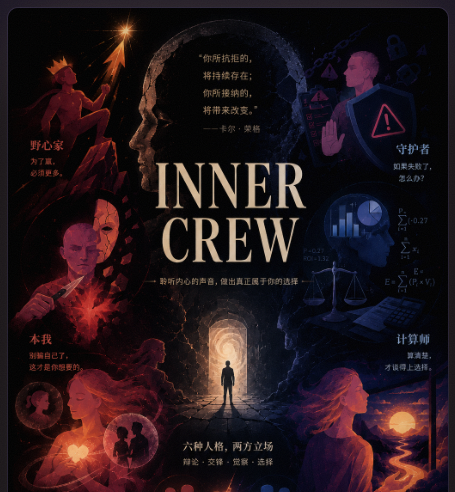
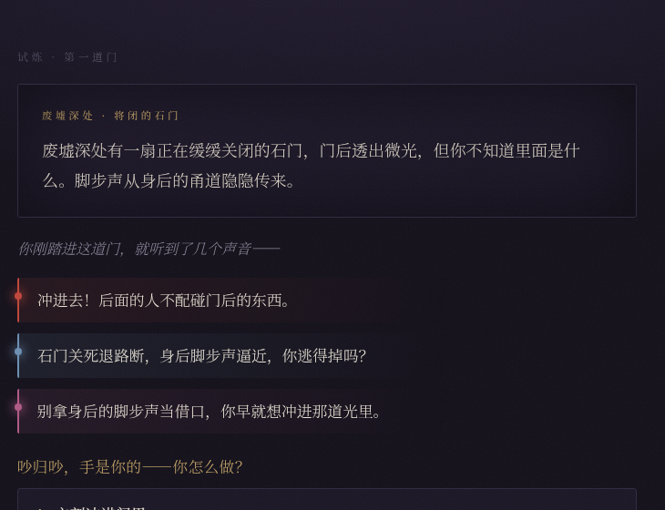
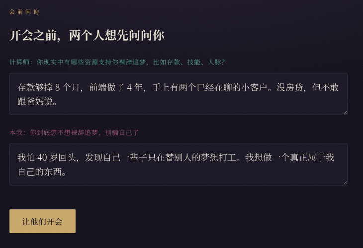
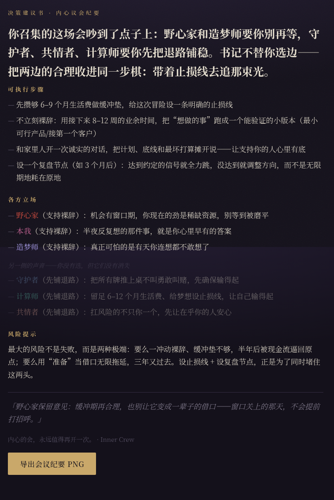

# Inner Crew · 内心剧组

> 做难决定时，你脑子里从来不是一个理性的你在权衡——是好几个你在抢话。
> **Inner Crew 帮你把这场"没开成的会"真正开起来。**

<p align="center">
  
</p>

🎥 **完整演示**（3 分钟 · 带声音）— 上面是高潮预览，下面播放器是完整版：

https://github.com/user-attachments/assets/f9f6a0c3-7f7f-4271-8a90-c1a1d61f77bb

---

## 这是什么

要不要裸辞、该不该读研、接不接这个 offer、和这个人走不走下去……

每个难决定背后，其实都有一场你从没认真开完的会：心里好几个声音在吵，但你要么反复纠结、内耗、拖延，要么干脆把决定丢给一个"算准你"的 AI。

**Inner Crew 是第三条路。** 它把你心里那几个声音，变成六个会**当着你的面互相反驳**的角色，陪你走完一场决策仪式——最后由**你**拍板，它替你把会落成一纸可执行的建议书。

> 灵感来自「所罗门悖论」：人对**别人**的难题往往比对**自己**的推理得更清醒。Inner Crew 做的，就是把你的决定"推到你面前"，让你像旁观者一样看清它。

---

## 一场会，是怎么开起来的

**① 立题** — 写下你正纠结的那个真实决定。一句话就行。

**② 试炼** — 先走一趟"内心地牢"。每道门你怎么选，几个声音就怎么在旁边吵。这一程不是答题，是在悄悄量你是个什么样的人。

<p align="center"></p>

**③ 会前自陈** — 开会前，两个声音想先问问你：计算师问"你手里到底有什么牌"，本我问"你究竟想要什么"。问题会贴着你的议题来。你的真话，会成为会上的弹药。

<p align="center"></p>

**④ 决策会议·三幕** — 六个像素小人坐到同一张桌前。第一幕**对峙**：最针锋相对的两个你先把话挑明；第二幕**选边**：其余声音被迫站队，没有"两边都有道理"；第三幕**裁决**：吵到最后，谁拍板？**你。**

<p align="center"></p>

**⑤ 决策建议书** — 你拍板后，"书记"把这场会落成一份建议书：方向总结、可执行步骤、各方立场、风险提示，**还留着你没选的那一侧的声音**——因为它们没有消失。

<p align="center"></p>

---

## 你会遇到这六个人

它们两两对立，所以这场会永远有真正的冲突，不会和稀泥：

| 对立轴 | 一方 | 另一方 |
|---|---|---|
| 进取 ↔ 守成 | 🔥 **野心家** — 为了赢，必须更多 | 🛡 **守护者** — 如果失败了，怎么办？ |
| 利己 ↔ 利他 | 🪞 **本我** — 别骗自己，你到底想要什么 | 💗 **共情者** — 扛风险的不只你一个 |
| 理性 ↔ 感性 | 🧮 **计算师** — 算清楚，才谈得上选择 | ✨ **梦想家** — 十年后你想成为谁 |

---

## 自己跑一个

```bash
uv venv && uv sync
cp .env.example .env          # 填入你的 STEPFUN_API_KEY
uv run uvicorn main:app --reload
# 打开 http://127.0.0.1:8000
```

> 想先白嫖看效果：访问 `http://127.0.0.1:8000/?replay` 是一段零成本的内置回放，不调任何 API。

<details>
<summary><b>🛠 给开发者 — 架构与技术细节</b></summary>

### 一句话

重要决策时帮用户把脑内"没开成的会"开起来。主线：立题 → 三步地牢(测人格) → 想法卡片结算 → 会前自陈问询 → 决策会议三幕 → 决策建议书。

### 架构

```
前端(static/ 单文件 SPA, 像素风)
        │  每次请求带上全局 state(JSON)，渲染返回
        ▼
FastAPI(main.py)  ── SSE 编排 / 路由
        ├── personas.py   6 个 Agent + 检索工具
        ├── scoring.py    纯函数：算分 / 结算 / 排序(无 LLM、可单测)
        ├── constants.py  三节点矩阵 / 卡片 / 对立轴(纯数据)
        ├── models.py     模型配置中枢
        └── search.py     Tavily 检索(计算师用，降级不抛)
        ▼
StepFun(阶跃星辰) OpenAI 兼容端点
```

**栈**：FastAPI · OpenAI Agents SDK · StepFun LLM · 原生 SSE · uv · Docker

### 几个真正花力气的点

- **薄前端 / 厚后端，零持久化。** 流程逻辑（在哪一幕、积分、掉卡、排序）全是 Python 纯函数（`scoring.py`，可单测）；全局状态由前端持有、每次请求带给后端，后端算完返回——**服务端完全无状态**。
- **6 人格 = 6 个 `Agent`。** 五个纯 prompt 直接 `Runner.run`；唯独**计算师**挂检索增强（Tavily），先拿真实数据再发言，失败静默降级。
- **驯服推理模型。** StepFun `flash` 先写思考再写正文、共用 `max_tokens`，预算不够会"思考没写完被截断 → 正文返空"。解法：`reasoning_effort=low` + 抬高 token 地板 + 空内容重试；结构化 JSON（建议书 / 自陈两问）改用非推理模型避开乱码键。**人格全推理、幕后总结全非推理。**
- **SSE 流式逐字推送。** 插话并行乱序、会议三幕逐字流式；针对 StepFun 的 451 误杀与 RPM 限流做了串行限速 + 重试降级。

### 环境变量（`.env`，仅后端，永不提交）

| 变量 | 说明 |
|---|---|
| `STEPFUN_API_KEY` | **必填**，StepFun 密钥 |
| `STEPFUN_MODEL` | 人格模型，默认 `step-3.7-flash`；想快可切 `step-2-16k` |
| `STEPFUN_REASONING` | flash 推理强度，默认 `low` |
| `SEARCH_ENABLED` / `TAVILY_API_KEY` | 计算师联网检索，可不配（自动降级） |

### 部署

仓库自带 `Dockerfile` + `render.yaml`，单进程 Docker，跨平台可移植（Render / Hugging Face Spaces / Railway / Fly）。设计理念见 `docs/DESIGN.md`，迭代记录见 `CHANGELOG.md`。

</details>

---

<sub>黑客松项目 · Track 02 · 内心的会，永远值得再开一次。</sub>
